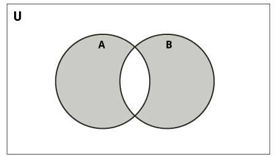

# Python Collection

- [Python Collection](#python-collection)
  - [简介](#%e7%ae%80%e4%bb%8b)
  - [Set](#set)
    - [创建 set](#%e5%88%9b%e5%bb%ba-set)
    - [set 操作](#set-%e6%93%8d%e4%bd%9c)
      - [对称差集](#%e5%af%b9%e7%a7%b0%e5%b7%ae%e9%9b%86)
    - [set 方法](#set-%e6%96%b9%e6%b3%95)
  - [Dictionary](#dictionary)
    - [创建 Dictionary](#%e5%88%9b%e5%bb%ba-dictionary)
    - [操作和方法](#%e6%93%8d%e4%bd%9c%e5%92%8c%e6%96%b9%e6%b3%95)
    - [方法](#%e6%96%b9%e6%b3%95)
  - [解压](#%e8%a7%a3%e5%8e%8b)
    - [字符串解压](#%e5%ad%97%e7%ac%a6%e4%b8%b2%e8%a7%a3%e5%8e%8b)
    - [部分解压](#%e9%83%a8%e5%88%86%e8%a7%a3%e5%8e%8b)
    - [解压多个元素](#%e8%a7%a3%e5%8e%8b%e5%a4%9a%e4%b8%aa%e5%85%83%e7%b4%a0)

***

## 简介

Python 内置集合类型包括：list, dict, set, tuple.

- [list](collect_list.md)
- [Tuple](collect_tuple.md)
- [deque](collect_deque.md)

## Set

set 是不包含重复值的无序集合。支持并集、交集、差集等集合操作。

### 创建 set

set 通过大括号创建，不同元素以逗号分隔，空 set 以 `set()` 创建。

```py
myset = {1, 2, 3}
```

### set 操作

set 由于元素是无序的，所以不能通过索引或 slicing 来访问。

| 集合操作 | 使用方法                                  |
| -------- | ----------------------------------------- |
| 并集     | 使用操作符 `|` 或者 `union()` 方法        |
| 交集     | 使用操作符 `&` 或者 `intersection()` 方法 |
| 差集     | 使用操作符 `-` 或者 `difference()` 方法   |

#### 对称差集



A 和 B 交集之外的内容。
使用 `^` 运算符或 `symmetric_difference()` 函数。

### set 方法

| 方法                              | 说明                                                                               |
| --------------------------------- | ---------------------------------------------------------------------------------- |
| set()                             | 创建一个空 set                                                                     |
| set(a_list)                       | 根据 list 元素创建 set                                                             |
| a_set.add(4)                      | 添加 4 到 a_set                                                                    |
| a_set.update(another_set)         | 将 another_set 中的元素全部添加到 a_set                                            |
| a_set.update(a_list)              | 同上                                                                               |
| a_set.discard(a_ele)              | 将 a_ele 元素从 a_set 中移除                                                       |
| a_set.remove(a_ele)               | remove 和 discard 的不同点是：如果set中不包含移除的元素，remove会抛出KeyError 异常 |
| a_set.pop()                       | 从 set 中移除一个元素，由于 set 是无序的，所以移除的元素随机                       |
| a_set.clear()                     | 移除所有元素，等同于 a_set=set(), 创建一个空 set, 覆盖a_set原来的值。              |
| 30  in a _set                     | 判断 30 是否在 a_set 中                                                            |
| a_set.union(b_set)                | 并集操作，返回一个新的集合                                                         |
| a_set.intersection(b_set)         | 交集操作                                                                           |
| a_set.difference(b_set)           | 差集操作                                                                           |
| a_set.symmetric_difference(b_set) | 只在一个 set 中出现的元素                                                          |
| a_set.issubset(b_set)             | a_set 是否是 b_set 的子集                                                          |
| b_set.issuperset(a_set)           | b_set 是否是 a_set 的超集                                                          |

## Dictionary

保存键值对的集合类型， mutable.

键必须可计算哈希值，值则可为任意类型。

### 创建 Dictionary

字典使用大括号 {} 创建，不同元素以逗号分开。

```py
friends = {
  'tom' : '111-222-333',
  'jerry': '666-33-111'
}
```

### 操作和方法

返回和指定键对应的值：

```py
dictionary_name['key']
```

如果对应键不存在，抛出 KeyError。

添加或修改值：

```py
dictionary_name['newkey'] = 'newvalue'
```

删除值：如果找到键，删除，如果没找到，抛出 KeyError

```py
del dictionary_name['key']
```

读取所有值：

```py
for key in a_dict:
  print(key, ":", a_dict[key])
```

### 方法

| 方法                | 说明                                                                                                                                      |
| ------------------- | ----------------------------------------------------------------------------------------------------------------------------------------- |
| len(a_dict)         | 返回字典包含键值对个数                                                                                                                    |
| a_key in a_dict     | a_dict 是否包含指定键                                                                                                                     |
| a_key not in a_dict | a_dict 是否不包含 a_key 键                                                                                                                |
| ==, !=              | 两个字典是否包含相同键值对                                                                                                                |
| popitem()           | Returns randomly select item from dictionary and also remove the selected item                                                            |
| clear()             | Delte everything from dictionary                                                                                                          |
| keys()              | Return keys in dictionary as tuples                                                                                                       |
| values()            | Return values in dictionary as tuples                                                                                                     |
| get(key)            | 返回和 key 对应的值，如果 key 不存在，返回 None                                                                                           |
| pop(key)            | Remove the item from the dictionary, if key is not found KeyError will be thrown.                                                         |
| copy()              | 完全复制                                                                                                                                  |
| update(a_iter)      | 将一个 dict 或 iterable 的内容全部添加到当前 dict中。对 iterable 且没有 keys() 方法的对象，以 tuple处理，将前两个元素作为键值对添加到dict |
| items()             | 返回包含键值对的 tuple 的list                                                                                                             |
| type(a_dict)        | 获得类型信息                                                                                                                              |
| cmp(a_dict, b_dict) | 对比两个字典的键和值                                                                                                                      |
| str(a_dict)         | 字符串                                                                                                                                    |

## 解压

装箱：使用多个变量，创建 Tuple、List 等序列对象.

拆箱：使用序列给多个变量赋值。

任何序列（或可迭代对象）可以通过一个简单的赋值语句解压并赋值给多个变量，只要**变量数量和序列元素的数量相同**。如果变量个数和元素个数不匹配，抛出异常。

例如

```py
v = ('a', 2, True)
(x, y, z) = v
a, b, c, = v # 也可以不带括号
```

基于该原理，可以很容易的值互换：

```py
a, b = b, a
```

如果有个变量带 `*` 号，则多余的值全部给该变量。

### 字符串解压

这种解压方式可以用在任意可迭代对象上。例如字符串：

```py
s = 'hello'
a, b, c, d, e = s
assert a == 'h'
assert b == 'e'
assert c == 'l'
assert d == 'l'
assert e == 'o'
```

### 部分解压

有时候你只需要部分数据，Python 没有提供这种语法，但是可以用占位符，丢掉这些变量即可。比如使用 `_` 或 `ign`。

这里使用 `_` 占位，要保证该占位符没有用作其它变量名。

```py
>>> data = [ 'ACME', 50, 91.1, (2012, 12, 21) ]
>>> _, shares, price, _ = data
>>> shares
50
>>> price
91.1
```

### 解压多个元素

如果可迭代对象的元素个数超过变量数，抛出 `ValueError`，但是你确实不需要这么多数据怎么办?

可以用 Python 星号表达式解决这个问题。比如，你在学习一门课程，在学期末的时候， 你想统计下家庭作业的平均成绩，但是排除掉第一个和最后一个分数。如果只有四个分数，你可能就直接去简单的手动赋值， 但如果有 24 个呢？这时候星号表达式就派上用场了：

```py
def drop_first_last(grades):
    first, *middle, last = grades
    return avg(middle)
```

另外一种情况，假设你现在有一些用户的记录列表，每条记录包含一个名字、邮件，接着就是不确定数量的电话号码。 你可以像下面这样分解这些记录：

```py
>>> record = ('Dave', 'dave@example.com', '773-555-1212', '847-555-1212')
>>> name, email, *phone_numbers = record
>>> name
'Dave'
>>> email
'dave@example.com'
>>> phone_numbers
['773-555-1212', '847-555-1212']
```

值得注意的是上面解压出的 `phone_numbers` 变量永远都是列表类型，不管解压的电话号码数量是多少（包括 0 个）。 所以，任何使用到 phone_numbers 变量的代码就不需要做多余的类型检查去确认它是否是列表类型了。

星号表达式也能用在列表的开始部分。比如，你有一个公司前 8 个月销售数据的序列， 但是你想看下最近一个月数据和前面 7 个月的平均值的对比。你可以这样做：

```py
*trailing_qtrs, current_qtr = sales_record
trailing_avg = sum(trailing_qtrs) / len(trailing_qtrs)
return avg_comparison(trailing_avg, current_qtr)
```

星号解压语法在字符串操作的时候也会很有用，比如字符串的分割。

```py
>>> line = 'nobody:*:-2:-2:Unprivileged User:/var/empty:/usr/bin/false'
>>> uname, *fields, homedir, sh = line.split(':')
>>> uname
'nobody'
>>> homedir
'/var/empty'
>>> sh
'/usr/bin/false'
```

在很多函数式语言中，星号解压语法跟列表处理有许多相似之处。比如，如果你有一个列表， 你可以很容易的将它分割成前后两部分：

```py
>>> items = [1, 10, 7, 4, 5, 9]
>>> head, *tail = items
>>> head
1
>>> tail
[10, 7, 4, 5, 9]
```
