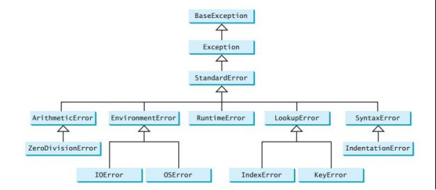

# Python 异常处理

- [Python 异常处理](#python-%e5%bc%82%e5%b8%b8%e5%a4%84%e7%90%86)
  - [简介](#%e7%ae%80%e4%bb%8b)
  - [异常处理](#%e5%bc%82%e5%b8%b8%e5%a4%84%e7%90%86)
  - [抛出异常](#%e6%8a%9b%e5%87%ba%e5%bc%82%e5%b8%b8)
  - [Exception 类型处理](#exception-%e7%b1%bb%e5%9e%8b%e5%a4%84%e7%90%86)
  - [标准异常列表](#%e6%a0%87%e5%87%86%e5%bc%82%e5%b8%b8%e5%88%97%e8%a1%a8)
  - [Assertion](#assertion)

## 简介

Python 提供了两种处理错误的方式：

- Exception Handling
- Assertions

## 异常处理

语法：

```py
try:
    # write some code
    # that might throw exception
except <ExceptionType>:
    # Exception handler, alert the user
```

实例：
```py
try:
	f = open('soemfile.txt', 'r')
	print(f.read())
	f.close()
except IOError:
	print('file not found')
```

捕获多种异常：
```py
try:
    <body>
except <ExceptionType1>:
    <handler1>
except <ExceptionTypeN>:
    <handlerN>
except:
    <handlerExcept>
else:
    <process_else>
finally:
    <process_finally>
```
说明：
- 上面，最后一个 except 的 ExceptionType 被省略，如果异常在最后一个 except 之前没有被捕获，则最后一个 except 被执行。
- else 语句只有在没有异常时才运行。
- finally 语句总会执行。

一次捕获多个异常：
```py
try:
	body
except (Exception1, Exception2):
	body
```

## 抛出异常
使用 raise 关键字在方法中抛出异常：
`raise ExceptionClass("Your argument")`

在 except 语句中，可以用不带参数的 raise 重新任意错误：
```py
try:
	body
except:
	raise
```

## Exception 类型处理
首先，获得异常的引用：
```py
try:
    # this code is expected to throw exception
except ExceptionType as ex:
    # code to handle exception
```

通过变量 `ex`，可以获得异常信息：
```py
try:
    number = eval(input("Enter a number: "))
    print("The number entered is", number)
except NameError as ex:
    print("Exception:", ex)
```

## 标准异常列表



| 异常类名              | 说明                                                               |
| --------------------- | ------------------------------------------------------------------ |
| ArithmeticError       | 数值计算异常的基类                                                 |
| AssertionError        | Assert 语句失败                                                    |
| AttributeError        | attribute 引用或赋值失败                                           |
| EOFError              | 当 raw_input() 或 input() 函数没有输入，或者到文件末尾             |
| Exception             | 所有异常的基类                                                     |
| FloatingPointError    | 当浮点计算失败                                                     |
| GeneratorExit         | 当 generator 的 `close()` 方法被调用                               |
| ImportError           | import 语句失败，即没有找到模块                                    |
| IndexError            | 在序列中找不到对应 index                                           |
| KeyError              | 在字典中找不到对应的 key                                           |
| KeyboardInterrupt     | 当用户打断程序运行，如按 Ctrl+C 或 delete                          |
| MemoryError           | 内存溢出                                                           |
| NameError             | 在 local 或 global 命名空间找不到指定标识符                        |
| NotImplementedError   | 子类没有实现特定的抽象方法                                         |
| OSError               | 系统操作导致的异常                                                 |
| OverflowError         | 当计算超过了数值类型的范围                                         |
| ReferenceError        | 使用 weak reference proxy 访问被垃圾回收的引用                     |
| RuntimeError          | 生成的错误，不在已有的任何分类中                                   |
| StopIteration         | 迭代器的 next() 方法不指向任何对象                                 |
| SyntaxError           | Python 语法错误                                                    |
| IndentationError      | 缩进不对                                                           |
| TabError              | 缩进 tabs 和 spaces 不一致                                         |
| SystemError           | 解释器发现内部错误，但是不退出                                     |
| SystemExit            | 由 sys.exit() 函数抛出                                             |
| StandardError         | 除 StopIteration 和 SystemExit 外的所有其他内置异常的基类          |
| TypeError             | 数据类型不对                                                       |
| UnboundLocalError     | 在方法中尝试获取局部变量的值，然而该局部变量没有初始化             |
| UnicodeError          | Unicode 相关的编码或解码错误                                       |
| UnicodeEncodeError    | Unicode 相关的编码错误                                             |
| UnicodeDecodeError    | Unicode 相关的解码错误                                             |
| UnicodeTranslateError | Unicode 相关的翻译错误                                             |
| ValueError            | 数据类型对的，但是数值不对                                         |
| ZeroDivisionError     | 当被除数为0或对0取模                                               |
| LookupError           | 所有 lookup 错误的基类                                             |
| EnvironmentError      | 所有在 Python 环境外抛出的错误的基类                               |
| IOError               | IO 错误                                                            |
| SystemExit            | 通过 sys.exit() 函数退出解释器，如果在代码中不处理，就使解释器退出 |

## Assertion

```py
assert 2 + 2 == 4
```

assert 语句如果错误，抛出异常 AssertionError。

assert 可以带参数，在抛出异常时输出：

```py
tmp = -10
assert (tmp >= 0), "Colder than absolute zero!"
```
