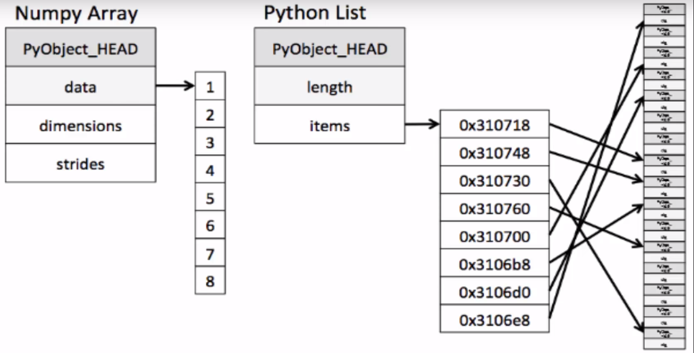
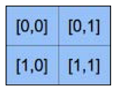

# Introduction

- [Introduction](#introduction)
  - [简介](#%e7%ae%80%e4%bb%8b)
- [ndarray](#ndarray)
- [基本操作](#%e5%9f%ba%e6%9c%ac%e6%93%8d%e4%bd%9c)
  - [矩阵操作](#%e7%9f%a9%e9%98%b5%e6%93%8d%e4%bd%9c)
  - [数组减法](#%e6%95%b0%e7%bb%84%e5%87%8f%e6%b3%95)
  - [数组指数](#%e6%95%b0%e7%bb%84%e6%8c%87%e6%95%b0)
  - [打印数组](#%e6%89%93%e5%8d%b0%e6%95%b0%e7%bb%84)
- [数据类型](#%e6%95%b0%e6%8d%ae%e7%b1%bb%e5%9e%8b)
  - [类型的字符表示](#%e7%b1%bb%e5%9e%8b%e7%9a%84%e5%ad%97%e7%ac%a6%e8%a1%a8%e7%a4%ba)
  - [类型的字符串表示](#%e7%b1%bb%e5%9e%8b%e7%9a%84%e5%ad%97%e7%ac%a6%e4%b8%b2%e8%a1%a8%e7%a4%ba)
  - [record](#record)

## 简介

[Numpy](https://github.com/numpy/numpy) 是 Python 科学计算的基础工具包，它提供了数组及数组的派生对象（如矩阵）的数据结构和运算，包含数组操作的各种方法，数学运算、逻辑运算、维度操作、排序、选择、IO、离散傅里叶变化、基本的线性代数和统计、随机模拟等。其提供的多维数组比 Python 的嵌套 list 要快许多。


Numpy 库的核心是 `ndarray` 对象，表示 N-维数组，Numpy 数组和标准 Python 序列有许多不同：

- `ndarray` 创建后大小固定，python list 则可以动态增长；修改 `ndarray` 大小实际是创建新的数组并删除原数组。
- `ndarray` 元素类型相同，因此每个元素占据的内存大小也相同。也有例外：使用对象类型作为数组类型，这样会使元素大小不一。
- `ndarray` 有助于对大量数据进行操作。通常来说，这些操作比 python 序列执行效率更高，代码更少。
- 越来越多的基于 Python 的科学和数学包使用 NumPy，虽然它们通常都支持 Python 序列输入，但是内部都是使用 NumPy 数组，且输出类型一般为 NumPy 数组。



从该图可以看出，为什么 python 数组比较占内存，且速度较慢。

NumPy 的数组类为 `ndarray`, 别名为 `array`。要记着，`numpy.array` 和标准库中的 `array.array` 是不同的。

`ndarray` 由两部分组成：
- 数据部分
- 描述数据的元数据

大部分的数组操作不改变 `ndarray` 的数据，而只是修改元数据。

# ndarray
NumPy 的核心对象是齐次多为数组，数组的维度称为 `axes`，并包含如下属性：

|属性|说明|
|---|---|
|`ndarray.ndim`|数组维度，又称为 rank|
|`ndarray.shape`|数组大小，tuple 类型，描述数组每个维度的长度，如 (n, m) 表示 n 行 m 列数组|
|`ndarray.size`|元素个数，对 (n, m) 数组，size=n*m|
|`ndarray.dtype`|数组元素类型|
|`ndarray.itemsize`|数组元素类型的字节大小。如 float64 对应 8 字节|
|`ndarray.data`|包含数组的缓冲数据，基本不用|

`ndarray.data` 属性包含实际的数组元素。一般不使用该属性，而使用索引方法。

对一个二维数，其索引如下：



# 基本操作
依次对数组元素执行指定操作。

|操作|说明	|
|---|---|
|a-b	|数组a和 b 长度相同，元素依次相减，得新数组|
|a** 2	|数组a 的元素依次平方，得新数组|
|np.sin(a)|对数组a的元素依次取sin值，得新数组|
|a < 35	|将数组a的元素依次和 35 对比，得相同大小的bool数组|
|b += a	|将 a 的值加到 b上|
|a.sum()|数组元素加和|
|a.min()|最小值|
|a.max()|最大值|
|a.sum(axis=0)|数组column 加和|
|a.min(axis=1)|每行的最小值|
|a.cumsum(axis=1)|每行的累计值|


## 矩阵操作

|操作|说明|
|---|---|
|A.dot(B)|矩阵点乘|


## 数组减法
```py
import numpy as np

a = np.array([20, 30, 40, 50])
b = np.array([0, 1, 2, 3])
c = a - b
#array([20,29,38,47])
```

## 数组指数
```py
b = np.array([0, 1, 2, 3])
b**2
# array([0, 1, 4, 9])
```

## 打印数组
用 `print()` 输出数组，当数组较大时，NumPy 自动省略中间部分的值，只打印首尾值，可以通过如下设置输出全部：
```py
np.set_printoptions(threshold='nan')
```

# 数据类型
NumPy 支持多种数据类型
|类型	|说明|
|---|---|
|bool	|Boolean (True or False)|
|inti	|Platform integer (int32 or int64)|
|int8	|Byte (-128, 127)|
|int16	|Integer (-32768, 32767)|
|int32	|Integer (-2**31, 2**31-1)|
|int64	|Integer (-2**63,2**63-1)|
|uint8	|Unsigned integer (0,255)|
|uint16	|Unsigned integer (0, 65535)|
|uint32	|Unsigned integer (0, 2**32-1)|
|uint64	|Unsigned integer (0, 2**64-1)|
|float16	|Half precision float: sign bit, 5 bits exponenet, 10 bits mantissa|
|float32	|Single precision float: sign bits, 8 bits exponent, 23 bits mantissa|
|float64 or float|Double precision float: sign bit, 11 bits exponent, 52 bits mantissa|
|complex64	|Complex number, represented by two 32-bit floats (real and imaginary components)|
|complex128 or complex|Complex number, represented by two 64-bit floats (real and imaginary components)|

说明：
- 除了 complex 数值，其他基本都能互相转换。
- real() 和 imag() 分别返回实部和虚部。
- dtyle.itemsize, 类型大小


## 类型的字符表示
|类型|字符|
|---|---|
|integer|I|
|Unsigned integer|u|
|Single precision float|f|
|Double precision float|d|
|bool|b|
|complex|D|
|string|S|
|unicode|U|
|Void|V|

## 类型的字符串表示
类型的字符串 `dtype.str` 表示。由三部分组成：
- endian
- type char
- type size
big-endian, >
little-endian, <
float64, '<f8'

## record
record 数据类型，由多种数据类型组成。

例如，创建一个包含字符串（40 位名称），整数（32 位，数目），浮点数（float32，价格）的类型，用于表示商品。

```py
t = np.dtype([('name', np.str_, 40), ('numitems', np.int32), ('price', np.float32)])
```