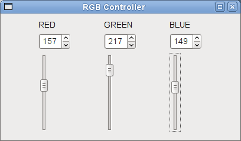
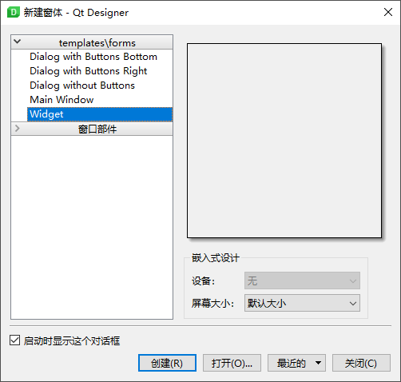
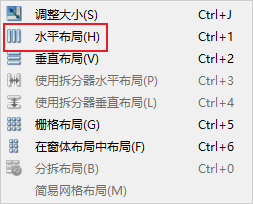
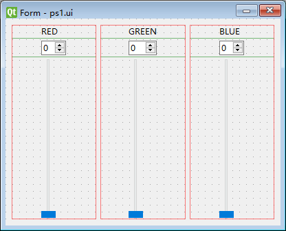
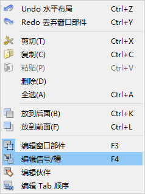
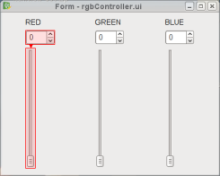
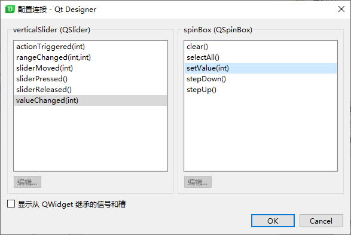
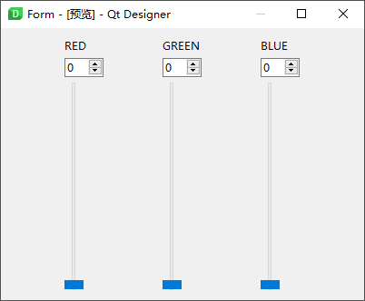
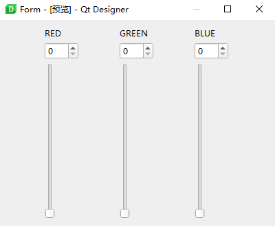
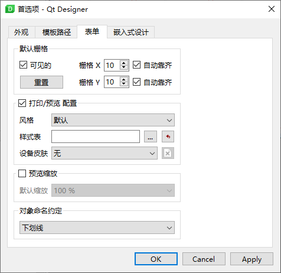

# Qt Designer 快速入门

- [Qt Designer 快速入门](#qt-designer-快速入门)
  - [简介](#简介)
  - [选择窗口](#选择窗口)
  - [添加组件](#添加组件)
  - [信号槽设置](#信号槽设置)
  - [预览](#预览)
  - [参考](#参考)

2021-03-25, 15:55
****

## 简介

使用 Qt Designer 包括四个基本步骤：

1. 选择窗口和对象
2. 将对象放在窗口中
3. 连接信号和槽（slot）
4. 预览

假设你想设计一个小部件，如下所示：

该控件可以操作 RGB 值，在许多图像处理软件中都能用到。

## 选择窗口

在新建窗口（form）的对话框中选择 `Widget`:

## 添加组件

拖动组件到窗口中：三个 `Label`，三个选值框（`QSpinBox`），三个垂直滑动条（`QSlider`）。

双击 `Label` 修改显示文本。Ctrl 选择 RED 以及对应的选值框和垂直滑动条，右键，选择布局，栅格布局，如下所示：

重复该步骤，将剩下的两组label, spinbox 和 slider 分别设置好。接下来是将三个布局合并到一起。主窗口 layout 即顶层控件的 layout，如果顶层窗口没有设置 layout，会导致其中的控件不随着窗口缩放。

在窗口任意空白位置点击鼠标右键，选择水平布局，此时效果如下：

当然，也可以选择“网格布局”，效果是一样的：

> 主窗口 layout 无法直接看出，可以通过拖动窗口调整大小，看看组件是否跟随了一起调整大小。也可以在对象查看器中查看，如果顶层容器没有设置布局，则显示图标：

## 信号槽设置

在你拖动滑块到指定值，希望选值框显示对应值。为了实现该功能，需要将 `QSlider` 的 `valueChanged()` 信号和 `QSpinBox` 的 `setValue()` 信号槽绑定。还需要反向绑定，即 `QSpinBox` 的 `valueChanged()` 与 `QSlider` 的 `setValue()` 绑定。

此时需要进入 “编辑信号/槽”模式，可以使用快捷键 F4，或选择菜单的 "编辑信号/槽"：

点击 `QSlider` 拖动红色箭头指向 `QSpinBox`:

配置连接的窗口弹出，选择正确的选项，即 `valueChanged(int)` 信号对应 `setValue(int)` 槽：

再反向操作一次。

然后对剩下两种颜色执行相同操作。

因为 RGB 值范围是 [0,255]，因此我们需要设置 QSpinBox 和 QSlider 值范围。

选择 `QSpinBox`，在属性编辑窗口有对应的属性值：

将 `maximum` 设置为 255.

## 预览

使用快捷键 `Ctrl+R` 或者使用菜单 "窗体->预览" 预览，查看最终效果：

从 Qt 4.4 开始，就可以使用各种样式进行预览。其功能等效于调用 `QApplication.setStyleSheet()`。

例如，以 Fusion 风格预览：

在首选项中，可以设置预览的样式：

## 参考

- https://doc.qt.io/qt-6/designer-quick-start.html
