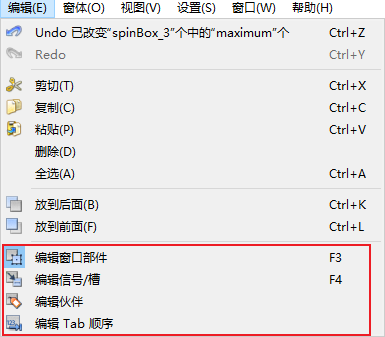
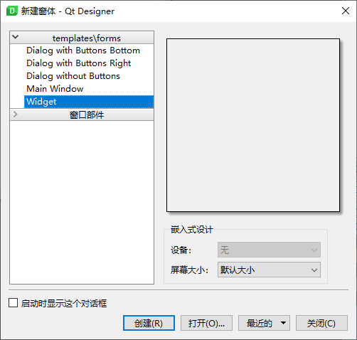
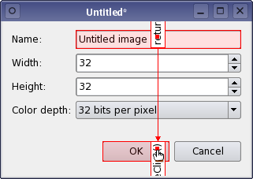
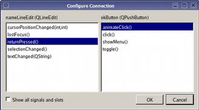
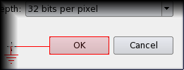
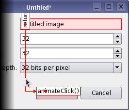
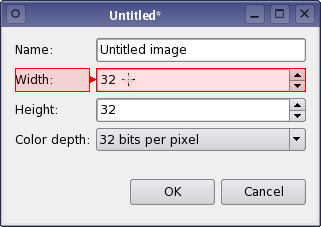
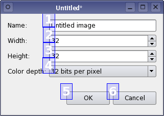

# Qt Designer 编辑模式

- [Qt Designer 编辑模式](#qt-designer-编辑模式)
  - [简介](#简介)
  - [Widget 编辑模式](#widget-编辑模式)
    - [属性编辑器](#属性编辑器)
  - [信号槽编辑模式](#信号槽编辑模式)
    - [连接对象](#连接对象)
    - [编辑和删除连接](#编辑和删除连接)
  - [Buddy 编辑模式](#buddy-编辑模式)
    - [连接 Label 和 Buddy 控件](#连接-label-和-buddy-控件)
    - [删除 Buddy 连接](#删除-buddy-连接)
  - [Tab Order 编辑模式](#tab-order-编辑模式)

2021-06-01, 12:54
****

## 简介

Qt Designer 提供了四种编辑模式：

|模式|图标|功能|
|---|---|---|
|Widget 编辑模式||界面外观编辑|
|Signals and Slots 模式||编辑 Qt 组件信号槽连接|
|Buddy 模式||buddy 控件可以分配给 label 控件，以处理键盘聚焦问题|
|Tab Order 编辑模式||设置控件接收键盘焦点的顺序|

可以通过菜单或工具栏切换不同模式，如下所示：

对应工具栏：

## Widget 编辑模式

在窗口编辑模式下，可以在窗体（form）中对控件进行添加、编辑、调整大小等操作。可以交互式的修改控件属性。

创建窗体：

- 菜单栏：文件->新建
- 快捷键：Ctrl+N

编辑完成的窗体，使用“保存”或“另存为”菜单进行保存。保存的 ui 文件包含窗体所有对象信息，以及信号槽连接信息。

操作：

- Ctrl+拖动，逐像素移动；
- Shift+Control+拖动，在 layout 中移动；

|操作|快捷键|说明|
|---|---|---|
|Cut|Ctrl+X|剪切|
|Copy|Ctrl+C|复制|
|Paste|Ctrl+V|粘贴|
|Delete|Delete|删除|
|Clone|Ctrl+drag|复制|
|Preview|Ctrl+R|预览|

以上除了 clone 命令，所有的操作都可以在 Edit 菜单和上下文菜单找到。

### 属性编辑器

属性编辑器显示当前选择对象的属性：

- 文本属性以 line edit 显示；
- 整数以 spin box 显示；
- boolean 属性以 checkbox 显示；
- 复合属性（如颜色，大小）以下拉框显示。

修改过的属性以**粗体**表示。

属性编辑器对某些特定属性会做特殊出力：

- 复合属性，即由多个值组成的属性，由可以扩展的 node 表示，并允许编辑值；
- 对包含多个选择的属性，由带选择框的 combo box 表示；
- 对可以访问丰富数据类型的属性，如 `QPalette`，则使用专门的对话框修改编辑。

## 信号槽编辑模式

在信号槽模式下，可以将窗体中的对象连接起来，保存窗体后，设置的连接都会保存。

### 连接对象

进入信号槽编辑模式，窗体上所有的控件和 layout 都可以连接在一起。spacers 只是为布局提供间距，所以没有连接其他对象的功能。

- 当光标位于可连接的对象上时，该对象将高亮显示。

按住鼠标左键将光标拖向要连接的对象。释放鼠标后，两个对象之间建立连接。

在拖动连接时，按 **Esc** 放弃连接。

- 在拖动连接后，会弹出配置连接窗口

在源对象上选择一个信号，在目标对象上选择一个槽，点击“确定”，完全连接。

- 连接窗体

在窗体上释放鼠标，可以连接对象和窗体。此时图标有所不同，如下所示：

### 编辑和删除连接

创建信号槽连接，在显示连接中默认会显示设计的信号和插槽。

在信号、槽连接之后，依然可以修改。双击连接路径即可编辑：

- 删除连接

点击路径可以选择连接。选择后，可以使用 Delete 键删除。

## Buddy 编辑模式

buddy 控件是 Qt 基本功能之一。当用户键入 `QLabel` 的快捷键时，Buddy 组件代替 `QLabel` 接受**输入聚焦**。

### 连接 Label 和 Buddy 控件

切换到 Buddy 模式，该模式和信号槽编辑模式类型，但是连接必然从 Label 控件开始。理想情况下，你应该将提供快捷方式的 `QLabel` 和对应的输入控件（如 `QLineEdit`） 连接起来。如下图所示：

### 删除 Buddy 连接

每个 `QLabel` 只能定义一个 buddy 控件。要更改使用的 buddy 控件，则必须删除已连接的 buddy 控件。

buddy 连接和信号槽连接的删除方式一样，选择连接后，使用 Delete 键删除。

## Tab Order 编辑模式

许多用户系统可以使用快捷键在不同的控件之间切换。Qt 允许使用 Tab 和 Shift+Tab 键在输入控件之间切换。默认的 Tab 键顺序取决于构建控件的顺序。一般这种方式就足够了，但是明确指出 Tab 顺序可以使得程序更易于使用。

进入 Tab 顺序编辑模式后，在该模式洗啊，每个输入控件都显示有一个数字，指示其在 Tab 中的顺序。

Tab 顺序通过按正确顺序点击每个数字来定义。
